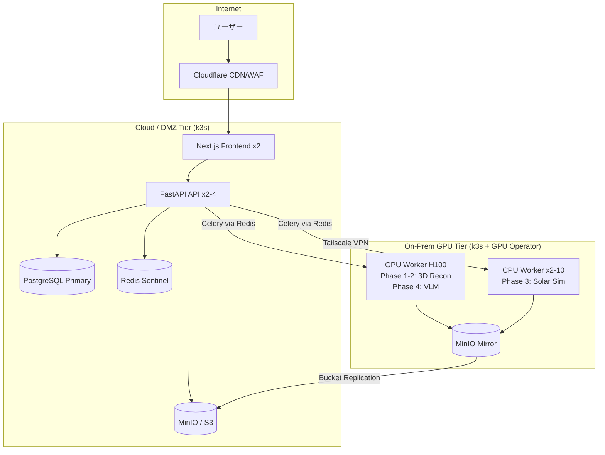
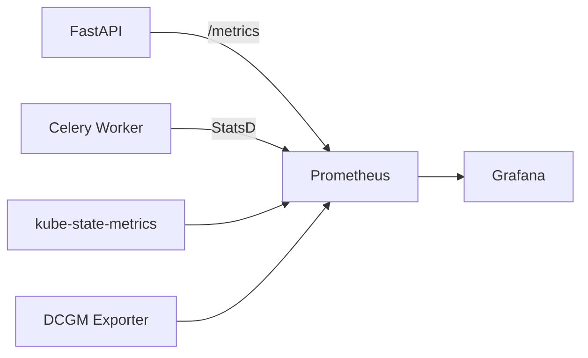
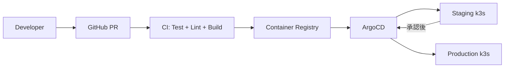

# ExaSense 本番インフラ構成設計

> オンプレGPU + クラウド ハイブリッドアーキテクチャ

## 1. 全体構成図

```
                    Internet
                       │
                  [Cloudflare]
                       │
          ┌────────────────────────┐
          │   Cloud / DMZ Tier     │
          │                        │
          │  ┌─────┐  ┌────────┐  │
          │  │Next │  │FastAPI │  │
          │  │.js  │  │(x2-4) │  │
          │  └─────┘  └───┬────┘  │
          │                │       │
          │  ┌──────┐ ┌────┴───┐  │
          │  │Redis │ │Postgres│  │
          │  │Sent. │ │Primary │  │
          │  └──────┘ └────────┘  │
          │  ┌──────┐              │
          │  │MinIO │              │
          │  │/S3   │              │
          │  └──────┘              │
          └────────┬───────────────┘
                   │ Tailscale VPN
          ┌────────┴───────────────┐
          │  On-Prem GPU Tier      │
          │  (工場データセンター)     │
          │                        │
          │  ┌──────────────────┐  │
          │  │GPU Worker (H100) │  │
          │  │ Phase 1-2: 3D再構│  │
          │  │ Phase 4: VLM推論 │  │
          │  └──────────────────┘  │
          │  ┌──────────────────┐  │
          │  │CPU Worker (x2-10)│  │
          │  │ Phase 3: 日照Sim │  │
          │  └──────────────────┘  │
          │  ┌──────────────────┐  │
          │  │MinIO Mirror      │  │
          │  │(メッシュ/結果)     │  │
          │  └──────────────────┘  │
          └────────────────────────┘
```



## 2. 3ティア構成の詳細

### 2.1 Web/API ティア (Cloud)

| コンポーネント | 仕様 | 備考 |
|----------------|------|------|
| Next.js Frontend | 2 replicas, Node 20 Alpine | 静的アセットはCloudflare経由 |
| FastAPI API | 2-4 replicas, Python 3.12-slim | uvicorn + gunicorn |
| PostgreSQL | 1 primary + 1 replica, 16.x | 永続化ボリューム 100GB |
| Redis Sentinel | 3ノード構成 | Celeryブローカー + WS Pub/Sub + キャッシュ |
| MinIO | S3互換オブジェクトストレージ | メッシュファイル、レポート保管 |

**API サーバー構成**:
- Gunicorn (process manager) + Uvicorn (ASGI worker)
- Worker数: 2-4 per pod (CPUコア数に応じて)
- ヘルスチェック: `/health` エンドポイント
- Graceful shutdown: SIGTERM → 30秒待機 → SIGKILL

### 2.2 CPU Worker ティア (On-Prem)

| コンポーネント | 仕様 | 備考 |
|----------------|------|------|
| Celery Worker (sim) | 2-10 replicas | KEDA queue-based autoscale |
| 処理内容 | Phase 3: 日照シミュレーション | pvlib + trimesh + Embree |
| リソース | 4 vCPU / 8GB RAM per worker | CPU bound |

**スケーリング戦略**:
- KEDA ScaledObject で Redis キュー長に応じて 0→10 スケール
- `simulation` キュー専用
- Idle時はゼロスケール（コスト最適化）

### 2.3 GPU Worker ティア (On-Prem)

| コンポーネント | 仕様 | 備考 |
|----------------|------|------|
| Celery Worker (GPU) | 1-2 replicas | NVIDIA GPU Operator |
| Phase 1-2 | VGGT/COLMAP → 3D再構築 | CUDA 12.4 |
| Phase 4 | Qwen3.5-VL 推論 | ~16GB VRAM |
| リソース | H100 80GB | nvidia.com/gpu: 1 |

**スケーリング戦略**:
- KEDA ScaledObject で `reconstruction` + `vlm` キュー監視
- 0→2 スケール（H100の数に制限）
- GPU メモリ解放のため、タスク間にクールダウン設定

## 3. ネットワーク設計

### 3.1 外部接続

```
User → Cloudflare (WAF/CDN) → Traefik Ingress → Service
```

- **Cloudflare Pro**: DDoS防御、WAF、SSL終端、CDN
- **Traefik IngressRoute**: k3s内部のL7ルーティング
  - `exasense.example.com` → Frontend
  - `api.exasense.example.com` → FastAPI
  - WebSocket: `wss://api.exasense.example.com/api/ws/*`

### 3.2 Cloud ↔ On-Prem 接続

```
Cloud k3s ←── Tailscale Mesh VPN ──→ On-Prem k3s
```

- **Tailscale**: NAT越え対応のWireGuardベースVPN
- **ACL**: RBACに基づくアクセス制御
  ```json
  {
    "acls": [
      {"action": "accept", "src": ["tag:cloud-api"], "dst": ["tag:onprem-worker:6379"]},
      {"action": "accept", "src": ["tag:onprem-worker"], "dst": ["tag:cloud-redis:6379"]},
      {"action": "accept", "src": ["tag:onprem-minio"], "dst": ["tag:cloud-minio:9000"]}
    ]
  }
  ```
- **DNS**: Tailscale MagicDNS でホスト名解決
- **帯域**: メッシュファイル(50-200MB)転送のため、最低100Mbps推奨

### 3.3 内部ネットワーク

- **k3s Service Mesh**: Flannel VXLAN (デフォルト)
- **NetworkPolicy**: Namespace間の通信を制限
  - `exasense` namespace内のみPod間通信許可
  - Ingress → Frontend/API のみ外部公開

## 4. ストレージ戦略

### 4.1 PostgreSQL

- **用途**: タスク管理、シミュレーション結果メタデータ、ユーザー管理
- **テーブル**:
  - `tasks` — タスクID、ステータス、パラメータ、結果JSON
  - `simulations` — シミュレーション設定、結果サマリー
  - `mesh_files` — メッシュメタデータ（実体はMinIO）
  - `users` — ユーザー情報、RBAC
- **バックアップ**: pg_dump daily → MinIO、WAL streaming to replica
- **マイグレーション**: Alembic (SQLAlchemy)

### 4.2 MinIO (S3互換)

- **用途**: メッシュファイル、GLBファイル、レポートPDF、シミュレーション可視化
- **バケット構成**:
  - `exasense-meshes` — アップロードされたメッシュ + 変換済みGLB
  - `exasense-reports` — 生成されたレポート (MD/JSON/PDF)
  - `exasense-models` — MLモデルウェイト (VLM, VGGT)
- **レプリケーション**: オンプレ MinIO → クラウド MinIO (Bucket Replication)
- **データ主権**: 原本は日本のオンプレに保持

### 4.3 Redis

- **用途**: Celeryブローカー/バックエンド、WebSocket Pub/Sub、セッションキャッシュ
- **構成**: Redis Sentinel (3ノード) for HA
- **チャネル**:
  - `celery` — タスクキュー (simulation, reconstruction, vlm)
  - `ws:progress:{task_id}` — WebSocket進捗配信
  - `session:{session_id}` — チャットセッション

## 5. セキュリティ

### 5.1 認証/認可

- **JWT認証**: FastAPI middleware
  - Access Token: 15分有効
  - Refresh Token: 7日有効 (HTTPOnly Cookie)
- **RBAC ロール**:
  - `admin` — 全操作 + ユーザー管理
  - `operator` — シミュレーション実行 + レポート閲覧
  - `viewer` — 結果閲覧のみ

### 5.2 ネットワークセキュリティ

- **Cloudflare WAF**: OWASP Top 10 ルールセット
- **NetworkPolicy**: Pod間通信を最小権限で制御
- **Tailscale ACL**: Cloud ↔ On-Prem 間のRBAC
- **TLS**: 全通信をTLS 1.3で暗号化

### 5.3 シークレット管理

- **SealedSecrets**: Kubernetes Secret をGit管理可能な形で暗号化
- **対象**: DB接続文字列、MinIOクレデンシャル、JWT署名鍵、Tailscale authkey

## 6. 監視/可観測性

### 6.1 メトリクス (Prometheus + Grafana)



**主要メトリクス**:
- API: リクエストレート、レイテンシ (p50/p95/p99)、エラーレート
- Celery: キュー長、タスク処理時間、失敗率
- GPU: 使用率、メモリ使用率、温度 (DCGM)
- インフラ: CPU/Memory/Disk 使用率、ネットワークI/O

### 6.2 ログ (Loki)

- **収集**: Promtail (DaemonSet) → Loki
- **ラベル**: namespace, pod, container, level
- **保持期間**: 30日

### 6.3 アラート

| アラート | 条件 | 重大度 |
|---------|------|--------|
| API High Error Rate | 5xx > 5% (5min) | critical |
| API High Latency | p95 > 5s (5min) | warning |
| Celery Queue Backlog | queue_length > 100 (10min) | warning |
| GPU OOM | gpu_memory > 95% (1min) | critical |
| Disk Space Low | disk_usage > 85% | warning |
| PostgreSQL Down | pg_up == 0 (1min) | critical |
| Redis Down | redis_up == 0 (1min) | critical |

### 6.4 ダッシュボード

- **ExaSense Overview**: API レイテンシ、スループット、エラーレート
- **Simulation Pipeline**: Phase別処理時間、キュー長、成功率
- **GPU Monitoring**: VRAM使用率、GPU温度、推論スループット
- **Infrastructure**: ノード状態、Pod状態、リソース使用率

## 7. DR/HA 戦略

### 7.1 高可用性 (HA)

| コンポーネント | HA方式 | RTO |
|----------------|--------|-----|
| Frontend | 2 replicas + Cloudflare failover | < 1分 |
| API | 2-4 replicas + readiness probe | < 30秒 |
| PostgreSQL | Primary + Streaming Replica | < 5分 (自動failover) |
| Redis | Sentinel (3ノード) | < 30秒 |
| GPU Worker | 1-2 replicas (再試行あり) | < 10分 |
| CPU Worker | KEDA autoscale 0-10 | < 2分 |

### 7.2 バックアップ

- **PostgreSQL**: 日次 pg_dump → MinIO、WAL連続アーカイブ
- **MinIO**: バージョニング有効、オンプレ→クラウド レプリケーション
- **Kubernetes**: etcd スナップショット日次
- **保持期間**: 日次 30日、週次 12週、月次 12ヶ月

### 7.3 災害復旧 (DR)

- **RPO**: < 1時間 (WAL streaming + MinIO replication)
- **RTO**: < 4時間 (k3s再構築 + データリストア)
- **手順**:
  1. クラウド側: k3s再構築 → Helm install → DBリストア
  2. オンプレ側: k3s再構築 → GPU Operator → Worker再起動
  3. 接続: Tailscale再接続 → 動作確認

## 8. コスト試算

### 8.1 オンプレ (CAPEX: 初期投資)

| 項目 | 仕様 | 見積 |
|------|------|------|
| GPUサーバー (H100 x2) | Dell/Supermicro 4U | 500-800万円 |
| CPUサーバー (Sim用) | 32core, 128GB RAM | 50-80万円 |
| NWスイッチ (25GbE) | ToRスイッチ | 20-40万円 |
| UPS + 空調 | ラック用 | 30-50万円 |
| **合計** | | **600-970万円** |

### 8.2 クラウド (OPEX: 月額ランニング)

| 項目 | 仕様 | 見積 |
|------|------|------|
| VPS x3 (API+Frontend+DB) | 4vCPU/16GB | 3-5万円 |
| Tailscale Business | ~100デバイス | 1-2万円 |
| Cloudflare Pro | | 0.3万円 |
| バックアップストレージ | 500GB | 0.5万円 |
| **月額合計** | | **5-8万円** |

### 8.3 年間総コスト

- **初年度**: 600-970万円 (CAPEX) + 60-96万円 (OPEX) = **660-1,066万円**
- **2年目以降**: 60-96万円/年 (OPEX) + 保守 ~50万円/年 = **110-146万円/年**

## 9. デプロイメントフロー



1. **開発**: feature branch → PR → CI (テスト + リント + イメージビルド)
2. **ステージング**: ArgoCD が自動sync → ステージング環境にデプロイ
3. **本番**: 手動承認後、ArgoCD が本番sync
4. **ロールバック**: ArgoCD のHistory から1クリックロールバック

## 10. 設計判断の根拠

### なぜ k3s か (EKS/GKE ではなく)

- 10-100人規模ではEKSコントロールプレーン費用 (~月1万円) が不要
- オンプレGPUサーバーにも同一のk3sが動作（軽量: ~512MB RAM）
- Tailscaleと組み合わせて統一メッシュネットワーク構築可能
- Helm/ArgoCD等のエコシステムはそのまま利用可能

### なぜ MinIO か (S3 直接ではなく)

- オンプレでもクラウドでもS3互換APIで統一的にアクセス
- Bucket Replicationでオンプレ↔クラウド自動同期
- データ主権: 日本のオンプレに原本を保持
- 将来的にAWS S3への移行も互換APIのため容易

### WebSocket のマルチインスタンス対応

- 現状: インプロセス dict で接続管理（単一インスタンスのみ対応）
- 改善: Redis Pub/Sub バックエンドに変更
  - Celery worker が進捗を Redis channel に publish
  - 全APIインスタンスが subscribe
  - 接続中のWSクライアントに転送
