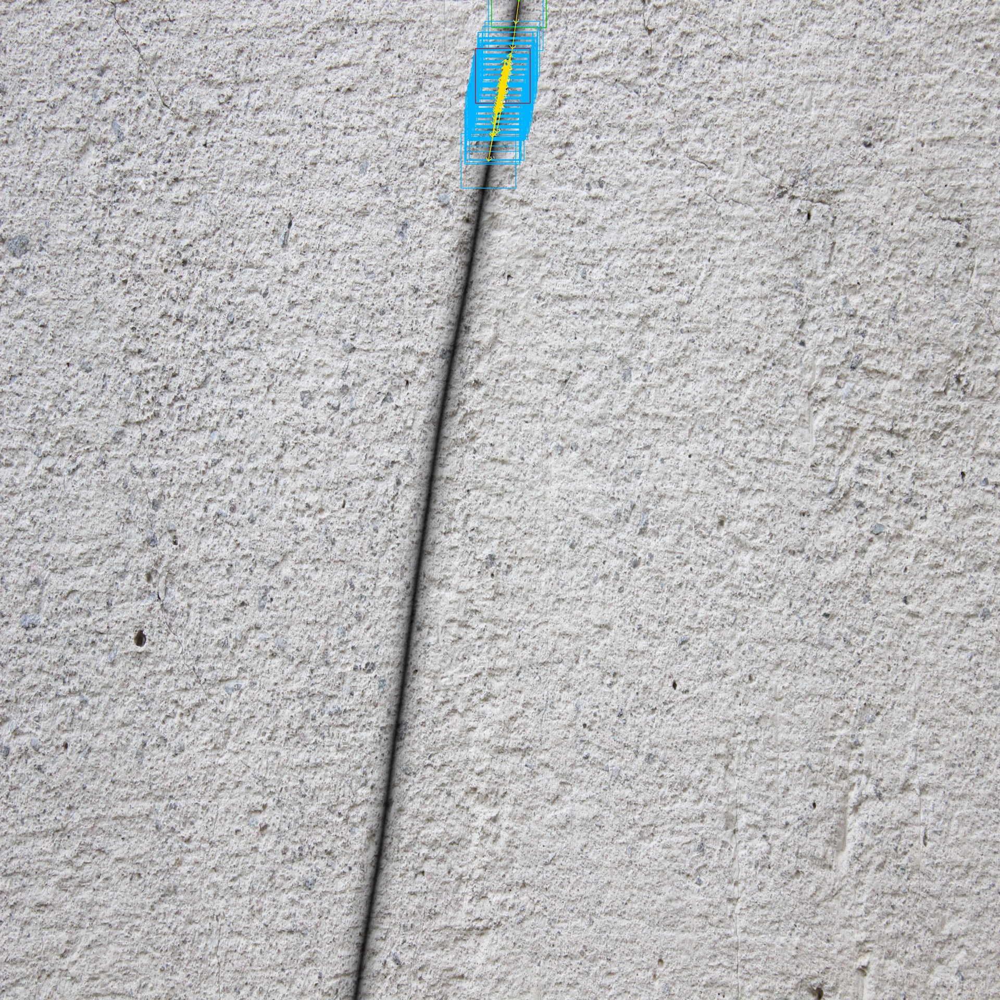
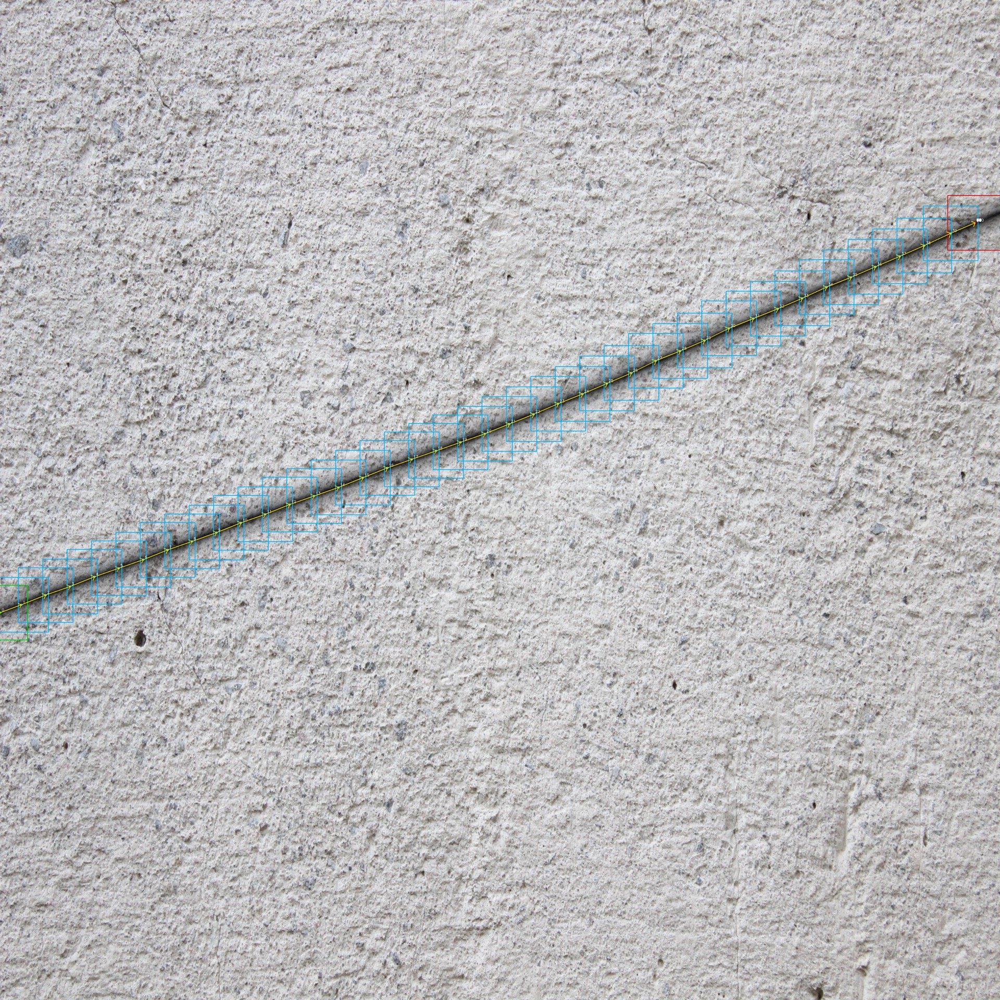
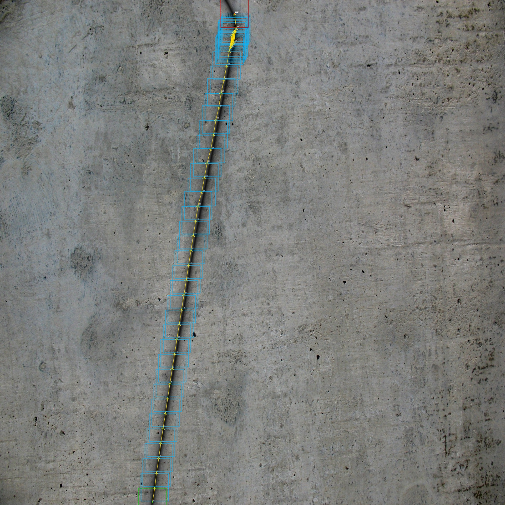
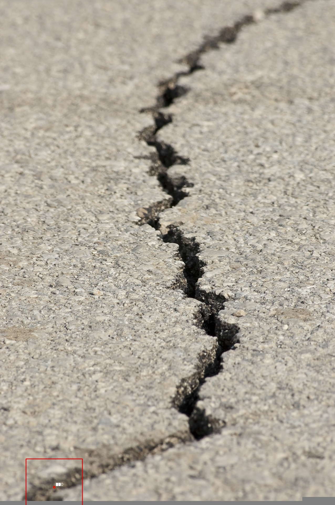
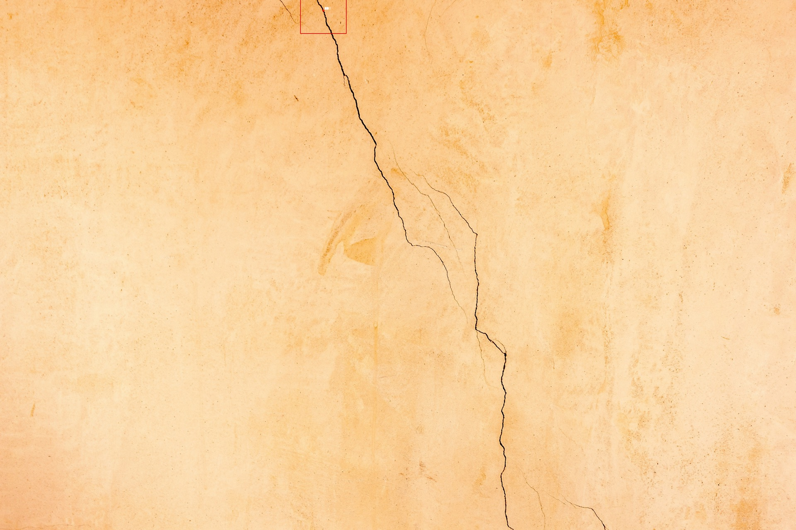
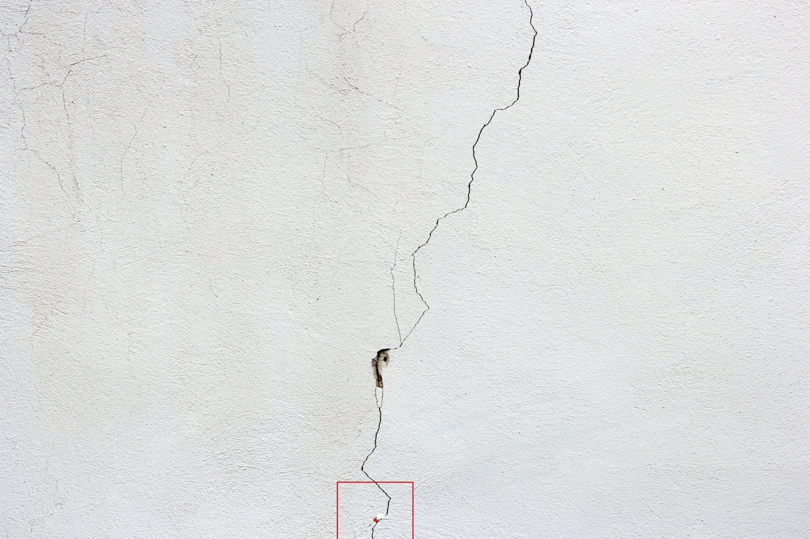
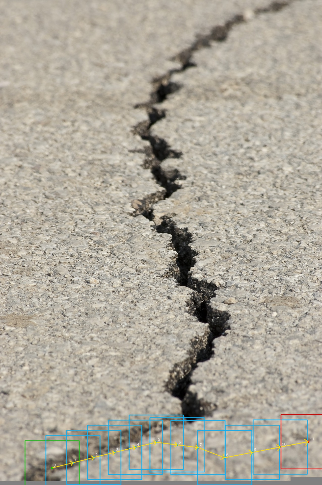
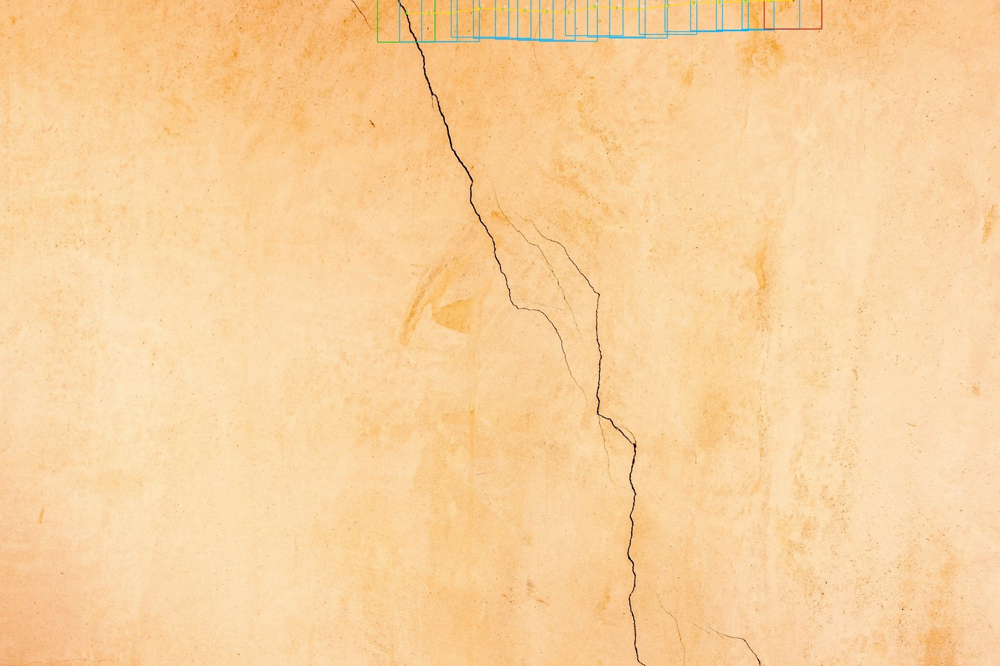
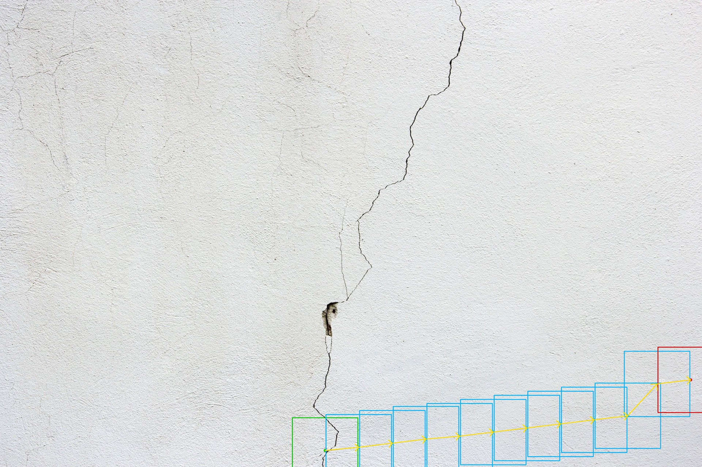
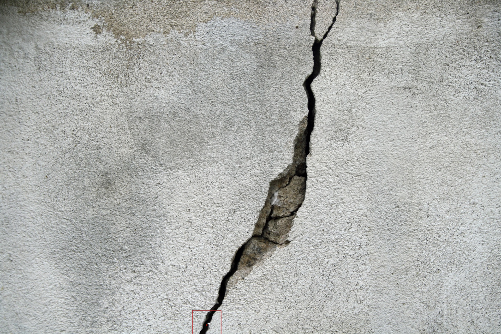

# OpenVLA Crack Line Tracing Agent

大規模インフラ画像（コンクリート壁・石材・アスファルト等）においてクラック（ひび割れ）の経路を自律的に追従する VLA エージェント。
OpenVLA 7B を LoRA ファインチューニングし、224×224 パッチを逐次観察しながら次の移動方向を予測する。

---

## プロジェクト概要

| 項目 | 内容 |
|------|------|
| **タスク** | クラック経路の自律追従（始点から終点まで） |
| **ベースモデル** | OpenVLA 7B (Vision-Language-Action model) |
| **ファインチューニング** | LoRA (rank=32) |
| **入力** | 224×224 パッチ画像 + 命令文 |
| **出力** | [Δx, Δy] 移動ベクトル（256 bin 離散トークン） |
| **訓練データ** | 合成生成クラック画像（コンクリート・石材・木目・アスファルト） |

### 主な機能 / ユースケース

- **合成データ生成**: テクスチャ・変形バリエーションを持つクラック画像をプログラム生成
- **LoRA ファインチューニング**: OpenVLA 7B をクラック追従タスクに特化して学習
- **パッチベース推論**: 224×224 パッチを逐次観察し [Δx, Δy] を予測して経路をたどる
- **汎化性能の検証**: 合成画像・自然画像の両方でロールアウト評価

---

## 技術スタック

| カテゴリ | 技術 |
|---------|------|
| **言語** | Python 3.10+ |
| **フレームワーク** | PyTorch 2.x (CUDA 12.1) |
| **VLA モデル** | OpenVLA 7B (LoRA ファインチューニング) |
| **LoRA 実装** | PEFT (`peft`) |
| **モデルロード** | Hugging Face Transformers 4.45.2 |
| **分散学習** | torchrun + Accelerate |
| **画像処理** | Pillow, OpenCV |
| **数値計算** | NumPy |
| **ログ** | TensorBoard |

---

## アーキテクチャ

```
大規模インフラ画像 (4096×4096)
    │
    ▼ クラック検出（生成時の正確なパス or 外部セグメンテーター）
クラック経路座標列 [(x0,y0), (x1,y1), ...]
    │
    ▼ 弧長に基づく等間隔サブサンプリング（50% オーバーラップ）
ウェイポイント列
    │
    ▼ 224×224 パッチクロップ（ゼロパディング込み）
パッチ画像 + 命令文 "Follow the crack. Navigate to continue tracking the crack path."
    │
    ▼ OpenVLA 7B + LoRA (H100, bf16)
連続 2D ベクトル [Δx, Δy] → ActionTokenizer で 256bin 離散化
    │
    ▼ 次のパッチ中心座標 = 現在座標 + (Δx, Δy)
次ステップへ
```

### ActionTokenizer

アクション [Δx, Δy] を 256 個の均一ビンに離散化して文字列トークンとして出力する。
統計（平均・標準偏差）は訓練エピソードから自動計算し、`action_stats.npz` として保存。

---

## 開発環境と実行可能範囲

| スクリプト | Mac ローカル | H100 (Linux) | 必要な追加インストール |
|-----------|:-----------:|:------------:|----------------------|
| `generate_crack.py` | ✅ | ✅ | `pillow numpy` |
| `annotate.py`       | ✅ | ✅ | `pillow numpy opencv-python` |
| `convert_to_rlds.py`| ✅ | ✅ | Mac: `tensorflow-macos tensorflow-metal` / Linux: `tensorflow` |
| `train.py`          | ❌ | ✅ | `torch transformers peft accelerate tensorboard` |
| `infer.py`          | ❌ | ✅ | 上記 + `torch transformers peft` |
| `rollout.py`        | ❌ | ✅ | 上記 + `opencv-python` |

**Mac で学習・推論が動かない理由**: OpenVLA 7B は bf16 で約 14GB VRAM が必要。Mac の MPS では速度・メモリ両面で非現実的。

---

## 推奨開発フロー

```
[Mac ローカル]                              [H100]
─────────────────────────────────           ──────────────────────────────
Step 1: クラック画像生成                     Step 3: LoRA ファインチューニング
  generate_crack.py              →  転送  →  train.py
                                                    ↓ チェックポイント
Step 2: アノテーション確認（任意）           Step 4: 推論 / ロールアウト
  visualize_annotation.py        ←  転送  ←  infer.py / rollout.py
```

---

## 実験結果

### 学習曲線


---

### 可視化の凡例

| 色 | 意味 |
|----|------|
| 🟩 **緑枠** | 追従開始パッチ（始点） |
| 🟥 **赤枠** | 追従終了パッチ（終点） |
| **シアン矢印** | モデルが予測した移動方向（パッチ間接続） |

---

### exp1: テストデータでのロールアウト（合成クラック画像）

学習時に使用していないテストエピソードに対して推論を実行し、クラック追従性能を検証。

| episode 0012 | episode 0057 | episode 0071 |
|:------------:|:------------:|:------------:|
|  |  |  |

---

### exp2: 自然画像でのロールアウト（best チェックポイント）

実際のクラック・錆画像に対してモデルを適用し、未知の自然画像への汎化性能を検証。

| earthquake | broken | white | crack |
|:----------:|:------:|:-----:|:-----:|
|  |  |  |  |

---

### exp2 (epoch1): 自然画像でのロールアウト（epoch 1 チェックポイント）

epoch 1 チェックポイントを使用した場合の比較結果。

| earthquake | broken | white | crack |
|:----------:|:------:|:-----:|:-----:|
|  |  |  |  |

---

## セットアップ

### 前提環境

| 項目 | バージョン |
|------|----------|
| OS | Ubuntu 22.04（学習・推論）/ macOS 可（データ生成のみ） |
| Python | 3.10+ |
| CUDA | 12.1 |
| GPU | NVIDIA H100（学習・推論）/ 不要（データ生成のみ） |
| PyTorch | 2.x (CUDA 12.1 対応) |

### インストール

#### Mac ローカル（データ生成のみ）

```bash
pip install pillow numpy opencv-python

# TFRecord 変換も Mac で行う場合（Apple Silicon）
pip install tensorflow-macos tensorflow-metal
```

#### H100（Linux）

```bash
# 1. PyTorch（CUDA 12.1 対応版）
pip install torch torchvision --index-url https://download.pytorch.org/whl/cu121

# 2. 学習・推論ライブラリ
pip install "transformers==4.45.2" peft accelerate tensorboard "timm>=0.9.10,<1.0.0"

# 3. データ生成・可視化ライブラリ
pip install pillow numpy opencv-python

# 4. 動作確認
python -c "import torch; print(torch.cuda.is_available())"  # True になること
```

### 環境変数設定

```bash
# GPU 選択（マルチ GPU 環境）
export CUDA_VISIBLE_DEVICES=0
```

---

## 実行方法

### エントリーポイント

```
generate_crack.py → train.py → infer.py / rollout.py
   データ生成         LoRA学習       推論・評価
```

| スクリプト | 役割 | Slurm スクリプト |
|-----------|------|----------------|
| `data_generation/generate_crack.py` | 合成クラック画像＆アノテーション生成 | `generate_data_slurm.sh` |
| `training/train.py` | LoRA ファインチューニング | `train_slurm.sh` |
| `training/infer.py` | 単一パッチ推論 / ロールアウト | `infer_slurm.sh` |
| `run_all_experiments.sh` | exp1/exp2 一括実行 | — |

---

### 学習方法

#### Step 1: クラック画像生成（Mac / H100）

```bash
# デフォルト: 100エピソード
python data_generation/generate_crack.py

# エピソード数・シードを指定
python data_generation/generate_crack.py \
  --n 300 \
  --seed 42 \
  --out data/crack_generated

# 実背景画像を使用する場合
python data_generation/generate_crack.py \
  --n 100 \
  --bg_dir images/ \
  --out data/crack_real_bg
```

| 引数 | デフォルト | 説明 |
|------|----------|------|
| `--n` | 100 | 生成エピソード数 |
| `--seed` | 42 | 乱数シード |
| `--out` | data/crack_generated | 出力ディレクトリ |
| `--bg_dir` | None | 実背景画像ディレクトリ（指定しなければ合成テクスチャ） |

出力ディレクトリ構造:

```
data/crack_generated/
  ├── 0000_concrete_none_w2.5.png     # 合成クラック画像 (4096×4096)
  ├── 0001_stone_wave_w3.0.png
  ├── ...
  └── annotations/
        ├── steps/
        │   ├── step_000000.png       # 224×224 パッチ画像
        │   └── ...
        └── episode_0000.json         # 各ステップの座標・アクション・命令文
```

生成されるバリエーション:

| テクスチャ | 変形モード | 線幅 |
|-----------|----------|------|
| `concrete`, `stone`, `wood`, `asphalt` | `none`, `wave`, `zigzag`, `bend` | 2.5〜4.0px |

Slurm を使う場合：

```bash
sbatch generate_data_slurm.sh
```

#### Step 2: アノテーション確認（Mac / H100、任意）

```bash
python data_generation/visualize_annotation.py \
  --data_dir data/crack_generated/annotations \
  --episode_id 0
```

#### Step 3: LoRA ファインチューニング（H100）

```bash
torchrun --nproc_per_node=1 training/train.py \
  --data data/crack_generated/annotations \
  --out  checkpoints/crack_openvla \
  --model openvla/openvla-7b \
  --epochs     5 \
  --lora_rank  32 \
  --batch_size 16 \
  --lr         5e-4 \
  --bf16
```

| 引数 | デフォルト | 説明 |
|------|----------|------|
| `--data` | — | アノテーションディレクトリ |
| `--out` | checkpoints/crack_openvla | チェックポイント保存先 |
| `--model` | openvla/openvla-7b | ベースモデル（HF ID） |
| `--epochs` | 5 | エポック数 |
| `--lora_rank` | 32 | LoRA rank |
| `--batch_size` | 16 | バッチサイズ |
| `--grad_accum` | 1 | 勾配累積ステップ数 |
| `--lr` | 5e-4 | 学習率（AdamW） |
| `--bf16` | False | bfloat16 混合精度（H100 推奨） |

データ分割: train 80% / val 10% / test 10%（エピソード単位・seed 固定）

Slurm を使う場合：

```bash
sbatch train_slurm.sh
```

学習 loss の確認（TensorBoard）：

```bash
tensorboard --logdir checkpoints/crack_openvla --port 6006
# SSH ポートフォワード: ssh -L 6006:localhost:6006 h100
```

---

### 推論方法

#### Step 4: 推論・ロールアウト（H100）

単一パッチ推論:

```bash
python training/infer.py \
  --model_path checkpoints/crack_openvla/best \
  --image path/to/patch.png
```

エピソード全体のロールアウト評価:

```bash
python training/infer.py \
  --ckpt_dir    checkpoints/crack_openvla/best \
  --image       path/to/image.png \
  --x 512 --y 512 \
  --max_steps   100 \
  --output_dir  results/rollout
```

| 引数 | 説明 |
|------|------|
| `--ckpt_dir` | LoRA チェックポイントディレクトリ |
| `--image` | 入力画像パス |
| `--x`, `--y` | 追従開始座標（ピクセル） |
| `--max_steps` | 最大ステップ数（デフォルト: 100） |
| `--output_dir` | 結果出力先（trajectory.jpg） |

Slurm を使う場合：

```bash
sbatch infer_slurm.sh
```

全実験を一括実行：

```bash
sbatch run_all_experiments.sh
```

---

## ディレクトリ構成

```
openvla-rust-tracing/
├── training/
│   ├── train.py                     # LoRA ファインチューニング（H100 必須）
│   ├── infer.py                     # 単一パッチ推論 / ロールアウト（H100 必須）
│   ├── action_tokenizer.py          # [Δx, Δy] の 256bin 離散トークナイザ
│   ├── rollout.py                   # エピソード全体のロールアウト評価
│   └── pick_start.py                # 追従開始点の選択
├── data_generation/
│   ├── generate_crack.py            # 合成クラック画像 + アノテーション生成
│   ├── visualize_annotation.py      # アノテーション可視化
│   ├── annotate.py                  # 手動アノテーション補助
│   ├── auto_annotate.py             # 自動アノテーション
│   ├── convert_to_rlds.py           # データセット検証・RLDS 変換
│   └── pick_start.py                # 追従開始点の手動選択
├── images/                          # 実クラック画像サンプル（汎化テスト用）
├── background/                      # 背景テクスチャサンプル
├── assets/
│   ├── loss/                        # 学習損失プロット
│   ├── exp1/                        # exp1 ロールアウト結果
│   ├── exp2/                        # exp2 ロールアウト結果（best チェックポイント）
│   └── exp2_epoch1/                 # exp2 ロールアウト結果（epoch1 チェックポイント）
├── generate_data_slurm.sh           # Slurm: データ生成ジョブ
├── train_slurm.sh                   # Slurm: 学習ジョブ
├── infer_slurm.sh                   # Slurm: 推論ジョブ
├── rollout_slurm.sh                 # Slurm: ロールアウトジョブ
└── run_all_experiments.sh           # exp1/exp2 一括実行スクリプト
```

---

## 使用データ

| データセット | 用途 | ライセンス | URL |
|---|---|---|---|
| 合成クラック画像（generate_crack.py 自動生成） | LoRA 学習データ | — | — |
| 自然クラック・錆画像（Pixabay サンプル） | 汎化テスト（exp2） | Pixabay License | https://pixabay.com |

---

## 使用モデル

| モデル名 | 用途 | ライセンス | 利用規約 URL |
|---|---|---|---|
| openvla/openvla-7b | LoRA ファインチューニングのベースモデル | MIT License | https://huggingface.co/openvla/openvla-7b |

---

## 評価指標

| 指標 | 説明 |
|------|------|
| **経路追従精度 (Path Following Accuracy)** | 予測ウェイポイントと正解ウェイポイントの平均 L2 誤差（px） |
| **方向誤差 (Angular Error)** | 予測移動方向と正解方向の角度差（度） |
| **完走率 (Episode Completion Rate)** | エピソード終点まで到達できた割合 |
| **ドリフト距離** | クラック本線からの平均逸脱距離（px） |
| **Validation Loss** | ActionTokenizer 離散化後のクロスエントロピー損失 |

---

## データ生成の詳細

### クラック形状のバリエーション

| パラメータ | 説明 |
|-----------|------|
| `deform=none` | 緩やかなカーブのみ（最大 45° 方向変化） |
| `deform=wave` | サイン波状の蛇行 |
| `deform=zigzag` | ランダムなジグザグ |
| `deform=bend` | 途中で一回大きく折れ曲がる |

### 描画アルゴリズム

リアルなひび割れ表現のため 3 層重ね描画を採用：

1. **影レイヤー**: 広め・薄い灰色 → ガウシアンブラーでふんわり
2. **芯レイヤー**: 中幅・暗い → 中ブラーでエッジを柔らかく
3. **中心線**: 細い・最も暗い → 軽くブラーして馴染ませる

その後、ガウスノイズを加えてリアリティを向上。

---

## 制約・注意事項

- `train.py` と `infer.py` は **NVIDIA H100（VRAM 約 14GB）が必須**。Mac では学習・推論は動作しない
- Hugging Face Hub から `openvla/openvla-7b`（約 14GB）をダウンロードするため、初回実行時にインターネット接続が必要
- アクション統計は **train セットのみ** から計算し、val/test へのリークを防止している
- データ分割は **エピソード単位**（ステップ単位ではない）で行い、時系列リークを防止
- 実背景画像（`--bg_dir`）を使用する場合は著作権フリー素材を利用すること
- OpenVLA のアクションヘッドは**改造しない**。アクション離散化はすべて ActionTokenizer が担当

---

## ライセンス

MIT License
