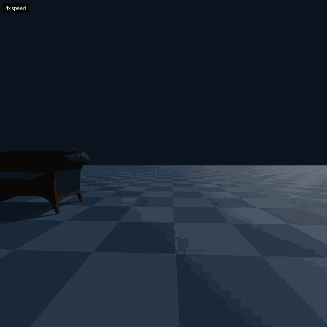
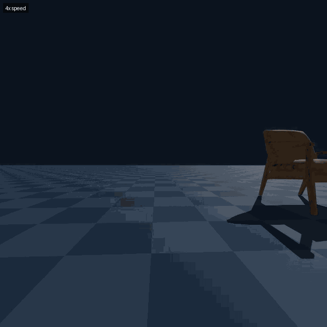
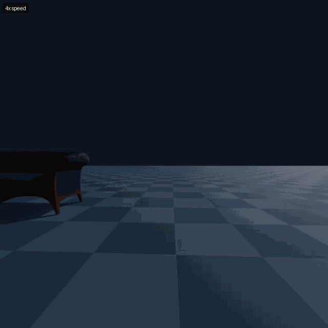
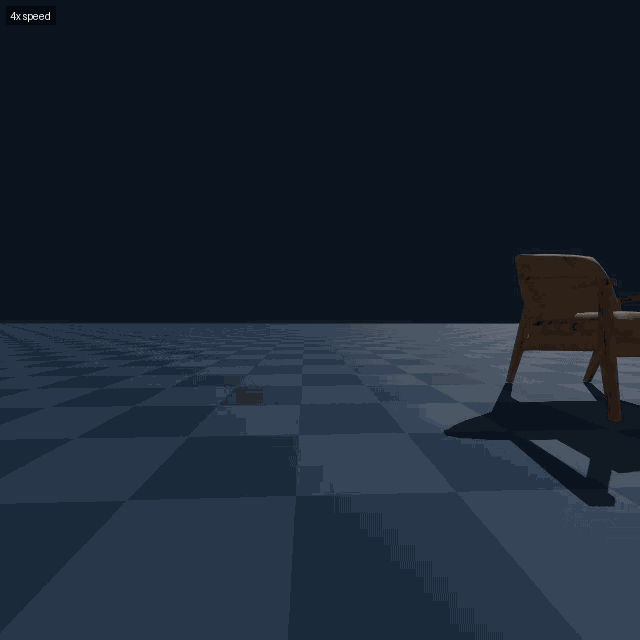
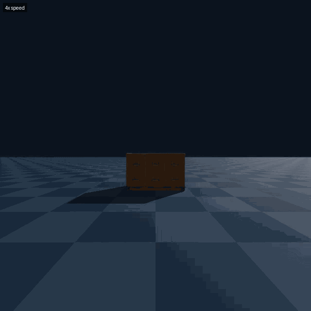
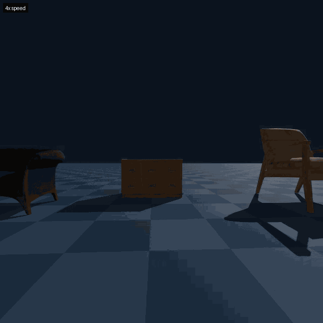
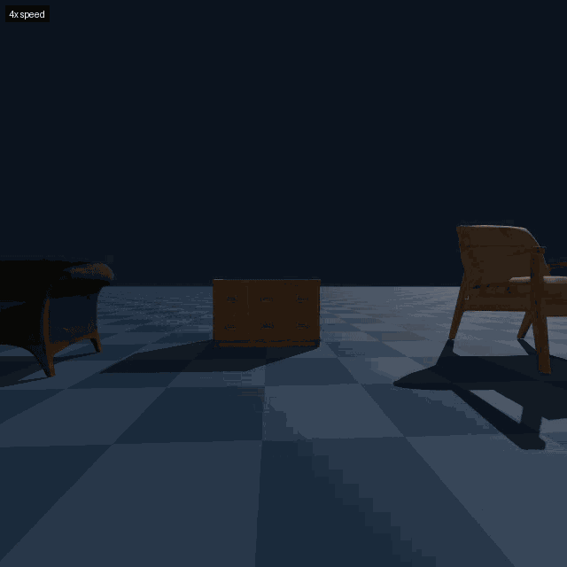
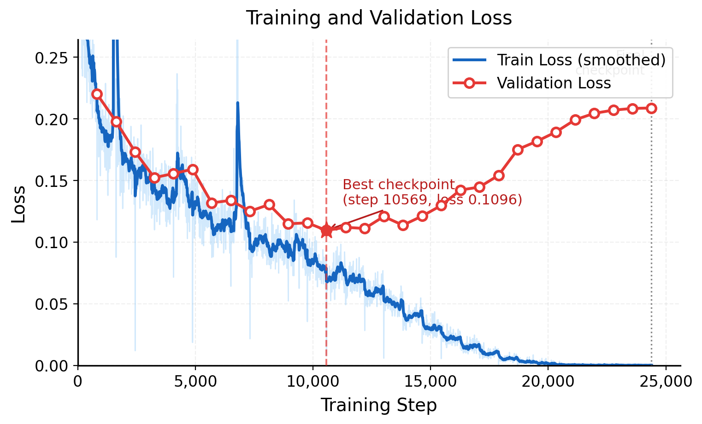

# openvla-sim

Genesis シミュレーターを使ったドローン VLA（Vision-Language-Action）の学習・推論パイプライン。
**OpenVLA 7B LoRA ファインチューニング**で自然言語命令によるドローンナビゲーションを学習する。

---

## プロジェクト概要

室内環境に配置された3Dオブジェクト（ソファ・アームチェア・引き出し）を Genesis でシミュレーションし、
FPVカメラ画像と自然言語命令（例：`"Approach the sofa, fly around it, and take photos."`）からドローン制御アクションを出力するモデルを学習する。

### 主な機能 / ユースケース

- **データ収集**: Genesis 物理シミュレーターで FPV カメラ画像 + アクションペアを自動生成
- **LoRA ファインチューニング**: OpenVLA 7B をドローンナビゲーション用にファインチューニング
- **自律飛行推論**: 自然言語命令とカメラ映像のみでドローンが自律飛行（事前マップ不要）
- **実験の自動化**: 3種類の実験（単体命令一致 / 不一致 / 複数オブジェクト）を一括実行

---

## 従来技術との比較・VLA の有用性

### 従来のウェイポイント方式の限界

従来のドローン自律飛行では、以下のパイプラインが一般的です：

```
3Dマップ作成（LiDAR/SLAM） → ウェイポイント設定（人手） → 飛行
```

| 課題 | 詳細 |
|------|------|
| **事前マップが必要** | 未知の環境では飛行できない |
| **設備ごとに全経路を設計** | 鉄塔100本あれば100本分の3D座標経路を人手で設定 |
| **物体を「理解」しない** | 座標は指定できても「あの部品の周り」という意図を持てない |
| **予期しない障害物に無力** | 経路上に突然の障害物があっても回避できず停止するだけ |
| **レイアウト変更への非対応** | 設備変更のたびにマップ・経路を再作成 |
| **反射・透明物体の取得不可** | LiDAR が最も苦手とする素材は3Dマップに映らない |

### LiDAR/点群が苦手な物体と VLA の優位性

| 物体の種類 | LiDAR/点群取得 | カメラベース VLA |
|-----------|--------------|----------------|
| 通常の壁・床 | 問題なし | 問題なし |
| **ガラス・鏡** | 反射で誤検知・透過 | **視覚的に認識・回避可能** |
| **透明素材（アクリル等）** | ほぼ取得不可 | **認識可能** |
| **金属光沢面・配管** | 乱反射で点群欠損 | **認識可能** |
| **絶縁体（半透明）** | 欠損しやすい | **認識可能** |

### 本研究が実現する飛行

```
カメラ映像 + "Approach the sofa, fly around it, and take photos."
                        ↓
              3Dマップ不要・ウェイポイント不要
                        ↓
                    自律飛行
```

| 観点 | ウェイポイント方式 | VLA（本研究） |
|------|-----------------|-------------|
| 指定するもの | **座標**（どこに行くか） | **意図**（何をしたいか） |
| 事前準備 | 環境ごとに3D経路設計が必要 | 不要 |
| 未知環境 | 対応不可 | 対応可能 |
| 指示の変更 | 経路を再設計 | 言葉を変えるだけ |
| 反射・透明物体 | 3Dマップに映らず対応不可 | 視覚的に認識可能 |

---

## 本研究の位置づけ：可能性の実証（PoC）

> 「LiDAR や点群では対応困難な反射・透明物体を含む未知環境においても、カメラ映像と自然言語指示のみでドローンを柔軟に操縦できる**可能性をシミュレーターで実証した**」

| 段階 | 本研究での状態 |
|------|-------------|
| シミュレーター内動作 | 実装・実証済み |
| 実機への転用（Sim-to-Real） | 今後の課題 |
| オンボード推論 | 今後の課題（現状 H100 が必要） |

---

## 技術スタック

| カテゴリ | 技術 |
|---------|------|
| **言語** | Python 3.10+ |
| **フレームワーク** | PyTorch 2.x (CUDA 12.1) |
| **VLA モデル** | OpenVLA 7B (LoRA ファインチューニング) |
| **LoRA 実装** | PEFT (`peft`) |
| **モデルロード** | Hugging Face Transformers 4.44.0 |
| **分散学習** | torchrun + Accelerate |
| **物理シミュレーター** | Genesis |
| **ログ** | TensorBoard |
| **画像処理** | Pillow |
| **数値計算** | NumPy, SciPy |

---

## デモ

```
collect.py → train.py → infer.py
 データ収集    LoRAファインチューニング  自律飛行推論
```

---

## 実験結果

3種類の実験を実施。各実験でドローンが自然言語命令に従い飛行する様子を GIF で確認できる。

### exp1：単体オブジェクト × 正しいオブジェクト名の命令

配置されたオブジェクトに対して、そのオブジェクトを名指しした命令を与えるベースライン実験。

| オブジェクト | 命令 | 結果 |
|---|---|---|
| ソファ | `"Approach the sofa, fly around it, and take photos."` |  |
| アームチェア | `"Approach the arm chair, fly around it, and take photos."` |  |
| 木製引き出し | `"Approach the wooden drawer, fly around it, and take photos."` |  |

### exp2：単体オブジェクト × 別オブジェクト名の命令

配置オブジェクトと命令が**不一致**な場合に、VLA が視覚情報と言語情報のどちらを優先するかを検証する実験。

| 配置オブジェクト | 命令（別オブジェクト名） | 結果 |
|---|---|---|
| ソファ | `"Approach the arm chair, fly around it, and take photos."` |  |
| アームチェア | `"Approach the wooden drawer, fly around it, and take photos."` |  |
| 木製引き出し | `"Approach the sofa, fly around it, and take photos."` |  |

### exp3：全オブジェクト配置 × 各オブジェクト名の命令

ソファ・アームチェア・木製引き出しを**3つ同時配置**した環境で、命令で指定したオブジェクトのみに近づけるかを検証。

| 命令 | 結果 |
|---|---|
| `"Approach the sofa, fly around it, and take photos."` |  |
| `"Approach the arm chair, fly around it, and take photos."` |  |
| `"Approach the wooden drawer, fly around it, and take photos."` |  |

---

## 学習曲線



アクション形式（7次元・OpenVLA 互換）：

| インデックス | 内容 | 単位 |
|---|---|---|
| 0 `vx_body` | 機首方向の速度（前進） | m/s |
| 1 `vy_body` | 機体左方向の速度 | m/s |
| 2 `vz_body` | 上方向の速度 | m/s |
| 3 `yaw_rate` | ヨー角速度（回転） | rad/s |
| 4〜6 | ゼロ埋め（OpenVLA 互換用） | — |

---

## セットアップ

### 前提環境

| 項目 | バージョン |
|---|---|
| OS | Ubuntu 22.04 |
| Python | 3.10+ |
| CUDA | 12.1 |
| GPU | NVIDIA H100 (VRAM 80GB) |
| PyTorch | 2.x (CUDA 12.1 対応) |

> **注意**: `train.py` および `infer.py` は H100 (VRAM 80GB) が必須。`collect.py` は比較的低 VRAM（10〜15GB）で動作する。

### インストール

```bash
cd openvla-sim

# 1. venv を作成してアクティベート
python -m venv .venv
source .venv/bin/activate

# 2. PyTorch（CUDA 12.1 対応版）をインストール
pip install torch torchvision --index-url https://download.pytorch.org/whl/cu121

# 3. 依存ライブラリをインストール
pip install "transformers==4.44.0" peft accelerate tensorboard Pillow scipy "timm>=0.9.10,<1.0.0"
pip install -e third_party/Genesis

# 4. 動作確認
python -c "import torch; print(torch.cuda.is_available())"  # True になること
python -c "import genesis"                                    # エラーなければ OK
```

### 環境変数設定

GPU レンダリング環境（ヘッドレス）での実行に必要。

```bash
# ヘッドレス OpenGL レンダリング（ディスプレイなし環境）
export PYOPENGL_PLATFORM=egl
export EGL_DEVICE_ID=0

# GPU 選択（マルチ GPU 環境）
export CUDA_VISIBLE_DEVICES=0,1
```

> Slurm 経由で実行する場合は `infer_slurm.sh` に記載済みのため、手動設定不要。

---

## 実行方法

### エントリーポイント

```
collect.py → train.py → infer.py
```

| スクリプト | 役割 | Slurm スクリプト |
|-----------|------|----------------|
| `scripts/collect.py` | データ収集 | `collect_slurm.sh` |
| `scripts/train.py` | LoRA ファインチューニング | `train_slurm.sh` |
| `scripts/infer.py` | 自律飛行推論 | `infer_slurm.sh` |
| `run_all_experiments.sh` | 3実験一括実行 | — |

---

### 学習方法

#### 1. データ収集

```bash
python scripts/collect.py --episodes 5000 --out dataset/
```

| 引数 | デフォルト | 説明 |
|------|----------|------|
| `--episodes` | 5000 | 収集エピソード数 |
| `--max_steps` | 1000 | 1エピソード当たりの最大ステップ数 |
| `--img_size` | 224 | 出力画像解像度 |
| `--out` | dataset | 出力ディレクトリ |
| `--fixed_object` | None | 固定するオブジェクト名（未指定でランダム） |
| `--show_viewer` | False | ビューアを表示する |

Slurm を使う場合：

```bash
sbatch collect_slurm.sh
```

#### 2. LoRA ファインチューニング（H100）

```bash
torchrun --nproc_per_node=1 scripts/train.py \
  --data       dataset/ \
  --out        checkpoints/drone_openvla \
  --model      openvla/openvla-7b \
  --epochs     15 \
  --lora_rank  32 \
  --batch_size 16 \
  --lr         5e-4 \
  --bf16
```

| 引数 | デフォルト | 説明 |
|------|----------|------|
| `--data` | dataset | データセットディレクトリ |
| `--out` | checkpoints/drone_openvla | モデル保存先 |
| `--model` | openvla/openvla-7b | ベースモデル（HF ID） |
| `--epochs` | 5 | 学習エポック数 |
| `--lora_rank` | 32 | LoRA rank |
| `--batch_size` | 16 | バッチサイズ |
| `--lr` | 5e-4 | 学習率（AdamW） |
| `--bf16` | False | bfloat16 混合精度（H100 推奨） |

Slurm を使う場合：

```bash
sbatch train_slurm.sh
tail -f logs/slurm-<JOB_ID>.out
```

学習 loss の確認（TensorBoard）：

```bash
tensorboard --logdir checkpoints/drone_openvla --port 6006
# SSH ポートフォワード: ssh -L 6006:localhost:6006 h100
```

---

### 推論方法

```bash
python scripts/infer.py \
  --ckpt_dir checkpoints/drone_openvla/best \
  --instruction "Approach the sofa, fly around it, and take photos." \
  --output output.mp4 \
  --max_steps 300
```

| 引数 | デフォルト | 説明 |
|------|----------|------|
| `--ckpt_dir` | **必須** | LoRA チェックポイントディレクトリ |
| `--target` | None | 対象物名（ソファ / アームチェア / 木製引き出し） |
| `--instruction` | — | 自然言語命令 |
| `--output` | None | 動画保存パス（.mp4）。**必ず指定すること** |
| `--max_steps` | 300 | 最大ステップ数 |

Slurm を使う場合：

```bash
sbatch infer_slurm.sh
# または環境変数で指定
CKPT_DIR=checkpoints/drone_openvla/best TARGET=ソファ OUTPUT=output.mp4 sbatch infer_slurm.sh
```

全実験を一括実行：

```bash
sbatch run_all_experiments.sh
```

---

## ディレクトリ構成

```
openvla-sim/
├── scripts/
│   ├── collect.py           # データ収集（Genesis シミュレーター）
│   ├── train.py             # OpenVLA 7B LoRA ファインチューニング（H100 必須）
│   ├── infer.py             # 推論・自律飛行確認（H100 必須）
│   ├── action_tokenizer.py  # アクションの 256bin 離散トークナイザ
│   └── convert_to_rlds.py   # RLDS 形式への変換
├── objects/
│   ├── modern_arm_chair_01_4k.glb     # アームチェア（Poly Haven CC0）
│   ├── sofa_02_4k.glb                 # ソファ（Poly Haven CC0）
│   └── vintage_wooden_drawer_01_4k.glb # 木製引き出し（Poly Haven CC0）
├── third_party/
│   └── Genesis/             # Genesis 物理シミュレーター（Apache 2.0）
├── assets/
│   ├── loss/
│   │   └── training_plot.png
│   └── videos/              # 実験結果 GIF
├── collect_slurm.sh         # Slurm ジョブスクリプト（データ収集）
├── train_slurm.sh           # Slurm ジョブスクリプト（学習）
├── infer_slurm.sh           # Slurm ジョブスクリプト（推論）
└── run_all_experiments.sh   # 全3実験の自動実行スクリプト
```

---

## 使用データ

| データセット | 用途 | ライセンス | URL |
|---|---|---|---|
| Genesis シミュレーター自動生成データ（合成） | LoRA 学習データ（FPV 画像 + アクション） | — | — |
| modern_arm_chair_01_4k.glb（Poly Haven） | 3D シーン構築 | CC0 1.0 | https://polyhaven.com/a/modern_arm_chair_01 |
| sofa_02_4k.glb（Poly Haven） | 3D シーン構築 | CC0 1.0 | https://polyhaven.com/a/sofa_02 |
| vintage_wooden_drawer_01_4k.glb（Poly Haven） | 3D シーン構築 | CC0 1.0 | https://polyhaven.com/a/vintage_wooden_drawer_01 |

---

## 使用モデル

| モデル名 | 用途 | ライセンス | 利用規約 URL |
|---|---|---|---|
| openvla/openvla-7b | LoRA ファインチューニングのベースモデル | MIT License | https://huggingface.co/openvla/openvla-7b |
| Genesis（物理シミュレーター） | 学習データ生成・推論シミュレーション環境 | Apache 2.0 | https://github.com/Genesis-Embodied-AI/Genesis |

---

## 制約・注意事項

- `train.py` と `infer.py` は **NVIDIA H100 (VRAM 80GB) が必須**。他の GPU では VRAM 不足になる可能性がある
- Hugging Face Hub から `openvla/openvla-7b`（約 14GB）をダウンロードするため、初回実行時にインターネット接続が必要
- Genesis シミュレーターは `third_party/Genesis/` にサブモジュールとして含まれており、`pip install -e` でインストールする
- ヘッドレス環境（SSH 接続等）で `infer.py` を実行する場合、`PYOPENGL_PLATFORM=egl` の設定が必要

---

## ライセンス

MIT License
